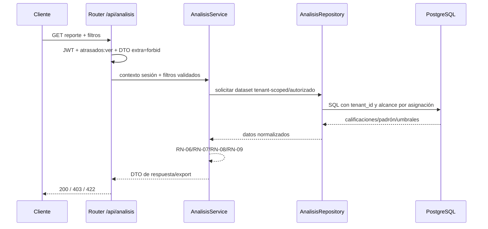

## Context

C-10 dejó disponibles `Calificacion` y `UmbralMateria` como fuente de verdad para notas, aprobación derivada y entregas sin corregir. C-11 agrega lectura analítica: transforma calificaciones, padrón activo y asignaciones vigentes en reportes para seguimiento académico. El dominio es MEDIO, pero hereda restricciones críticas: tenant isolation, identidad desde sesión, RBAC fail-closed y queries solo en repositories.

## Goals / Non-Goals

**Goals:**
- Exponer contratos estables bajo `/api/analisis/*` con permiso `atrasados:ver`.
- Calcular atrasados, ranking, resúmenes por materia, notas finales, monitores y export de TPs sin corregir.
- Respetar alcance por rol: PROFESOR/TUTOR ven alumnos asignados; COORDINADOR/ADMIN pueden consultar transversalmente dentro del tenant.
- Mantener lógica de negocio en Services y query/filtering en Repositories.

**Non-Goals:**
- No reimportar calificaciones ni cambiar umbrales.
- No crear comunicaciones automáticas; C-12 consume estos resultados después.
- No agregar tablas ni migraciones salvo que la implementación descubra una necesidad explícita.

## Decisions

### 1. Capacidad nueva `analisis-atrasados-reportes`

**Decisión:** crear un módulo de análisis independiente que consume specs/datos de `calificaciones` sin modificar esa capacidad.

**Rationale:** los reportes son una capa de lectura y agregación; separar evita mezclar importación con explotación analítica.

**Alternativa considerada:** extender `calificaciones` con endpoints analíticos. Rechazada porque haría crecer el módulo de ingesta y dificultaría el consumo posterior por C-12.

### 2. Services calculan reglas; Repositories preparan datasets tenant-scoped

**Decisión:** repositories devuelven filas/DTOs de consulta ya filtrados por tenant, materia, cohorte, asignación y permisos de alcance; services computan RN-06/RN-09 y composición de reportes.

**Rationale:** cumple Clean Architecture: sin SQL en Services y sin reglas de negocio en Routers.

**Alternativa considerada:** calcular todo con agregaciones SQL. Rechazada como diseño principal porque escondería reglas RN en queries difíciles de testear. Se permiten agregaciones en repositories solo si preservan contratos testables.

### 3. Atrasado se deriva en tiempo de consulta

**Decisión:** no persistir estado de atraso; derivarlo desde padrón activo, actividades seleccionadas/importadas, calificaciones y umbral vigente.

**Rationale:** evita estados obsoletos cuando cambian umbrales o imports.

**Alternativa considerada:** materializar un snapshot. Diferida hasta que existan necesidades de performance observadas.

### 4. Export como endpoint de lectura con formato estable

**Decisión:** `GET /api/analisis/tps-sin-corregir/export` genera CSV/archivo descargable desde el mismo caso de uso que lista TPs sin corregir.

**Rationale:** garantiza paridad entre monitor y export; evita duplicar RN-07/RN-08.

**Alternativa considerada:** job asíncrono de export. Rechazada por alcance inicial; revaluar si el volumen lo exige.

## API Shape

Todos los endpoints:
- Requieren sesión JWT válida y `require_permission("atrasados:ver")`.
- Derivan `tenant_id`, `usuario_id`, roles y asignaciones desde la sesión/contexto autorizado.
- Aceptan filtros académicos como IDs de negocio autorizables (`materia_id`, `cohorte_id`, `comision`, `regional`, fechas), nunca identidad ni tenant desde el request.
- Responden DTOs Pydantic v2 con `extra='forbid'`.

Contratos propuestos:
- `GET /api/analisis/atrasados`: alumnos atrasados con motivos (`actividad_faltante`, `nota_bajo_umbral`) y conteos.
- `GET /api/analisis/ranking-aprobadas`: ranking descendente de alumnos con `aprobadas_count >= 1`.
- `GET /api/analisis/materia/resumen`: métricas rápidas de materia/comisión.
- `GET /api/analisis/notas-finales`: nota final agrupada por alumno y actividades incluidas.
- `GET /api/analisis/monitor`: monitor filtrable; coordinación/admin admiten `fecha_desde`/`fecha_hasta`.
- `GET /api/analisis/tps-sin-corregir/export`: export de entregas textual-finalizadas sin calificación.

## Data and Authorization Flow

## Risks / Trade-offs

- **Volumen de reportes alto** → paginar monitores y limitar exports; índices existentes de C-10 deben revisarse durante apply.
- **Ambigüedad de actividades faltantes** → definir en specs como actividad presente en el conjunto analizado/importado para la materia y ausente para el alumno del padrón activo.
- **Alcance por rol incorrecto** → tests de autorización por PROFESOR/TUTOR vs COORDINADOR/ADMIN y tenant isolation.
- **Notas finales sin fórmula formal** → iniciar con agrupación/promedio simple o suma según actividades incluidas, documentada en DTO; dejar fórmulas ponderadas fuera de alcance si no existen en KB.

## Migration Plan

1. Agregar tests de contrato y servicio en RED.
2. Crear módulo `analisis` sin migración de schema.
3. Implementar repositories tenant-scoped.
4. Implementar services y routers.
5. Validar con DB real/efímera y cobertura de reglas.

Rollback: remover rutas y módulo `analisis`; no hay cambios persistentes que revertir.

## Open Questions

- Confirmar durante implementación si la nota final agrupada debe ser promedio simple de actividades incluidas o una agregación configurable futura. Para C-11 se especifica una agregación determinística mínima y exportable.
